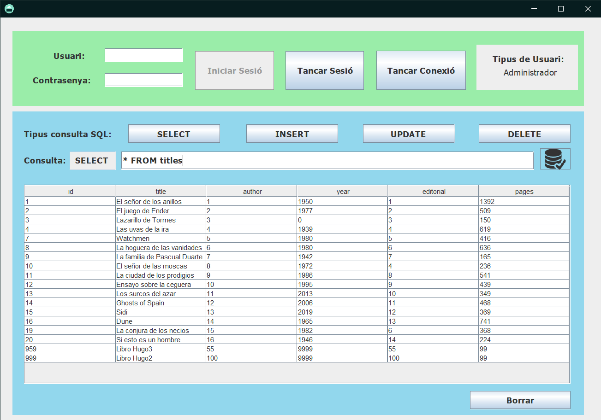
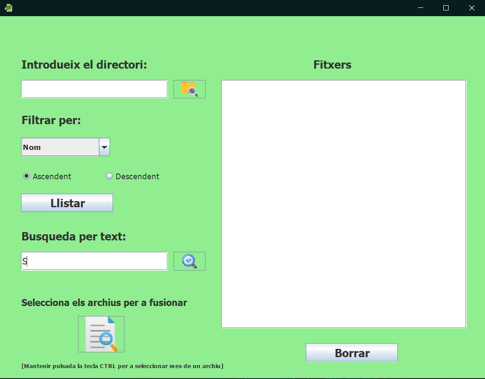

# Introduction

In this repository, you will find the projects I have developed in Java that I consider interesting.

# Projects

## SQL Query Application

This is an application developed using MVC that allows you to perform SQL queries on a database (INSERT/SELECT/UPDATE/DELETE). It distinguishes between two types of users: client and administrator. Client users are only allowed to perform SELECT queries, while administrators can perform all types of queries.

[YouTube Demo Video](https://www.youtube.com/watch?v=QAoY5XXy7qg)

Branch Name: SQL

## File Management Application

This is an application where you can search for directories, view the files in those directories, filter them, and search for text strings within different files.

[YouTube Demo Video](https://www.youtube.com/watch?v=-ElSsSQz4cA)

Branch Name: Ficheros

# Code

The code for each project can be found in the repository branch with the same name as the project.
