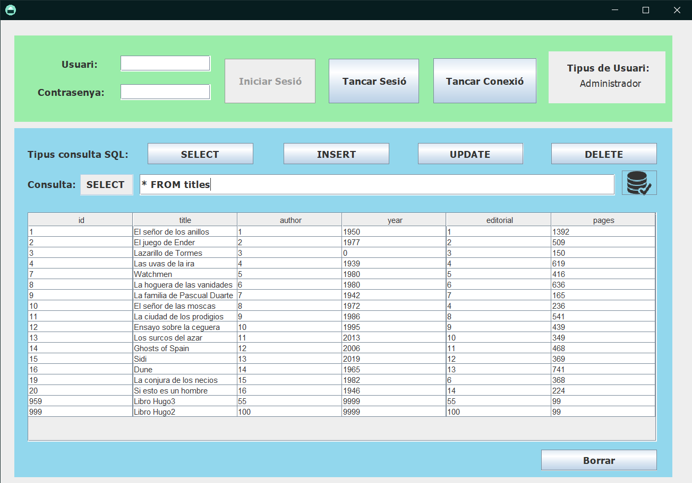
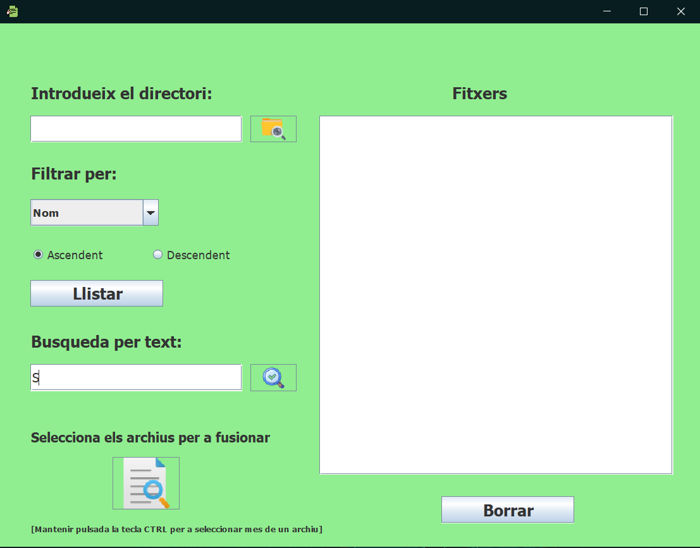

# Introducción

En este repositorio están los proyectos que he desarrollado en Java y he considerado interesantes.

# Proyectos

## Aplicacion de consultas SQL

Se trata de una aplicación desarrollada utilizando MVC que permite realizar consultas a una base de datos (INSERT/SELECT/UPDATE/DELETE). Distingue entre dos tipos de usuarios; cliente y administrador. A los usuarios clientes solo les permite realizar consultas SELECT mientras que a los administradores les permite realizar todo tipo de consultas.

[Video Demo en YouTube](link)

Nombre de la rama: SQL

## Aplicacion de gestión de ficheros.

Es una aplicación en la que podemos buscar directorios, nos visualiza los ficheros que se encuentran ese directorio, filtrarlos y buscar cadenas de texto dentro de los diferentes ficheros.

[Video Demo en YouTube](link)

Nombre de la rama: Ficheros

# Código

El codigo de cada proyecto se encuentra en la rama de este repositorio que tiene el mismo nombre que el proyecto.
